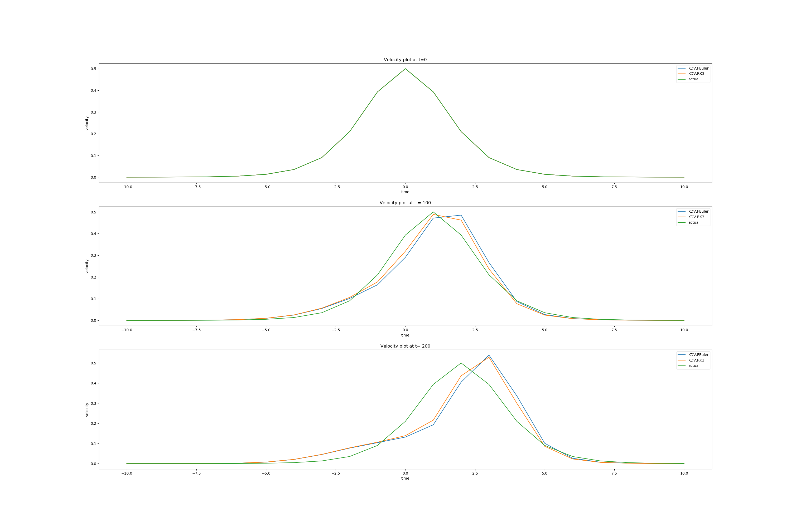
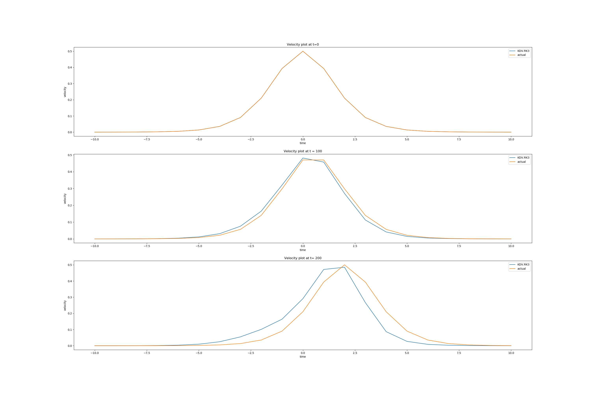
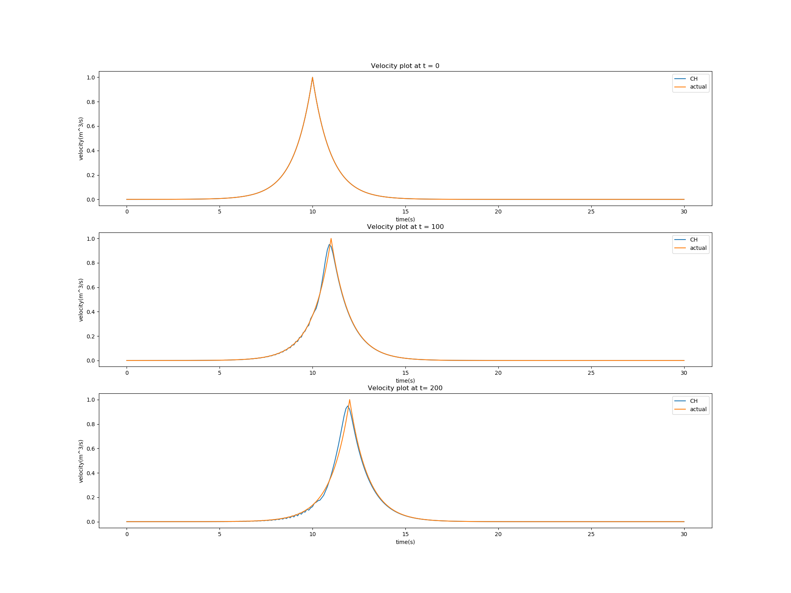
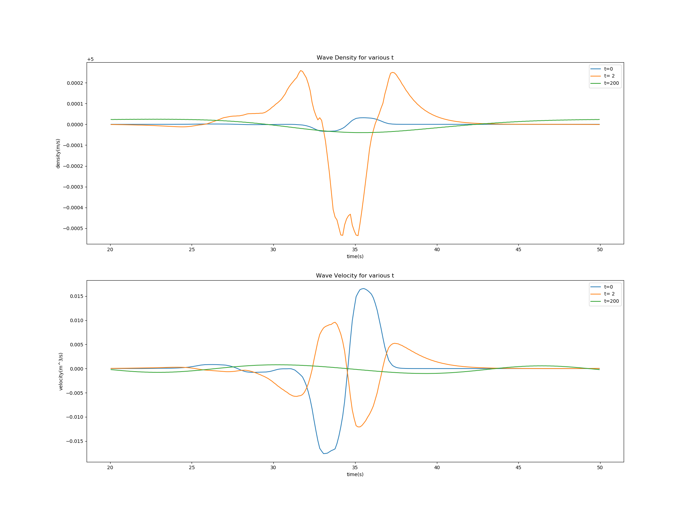
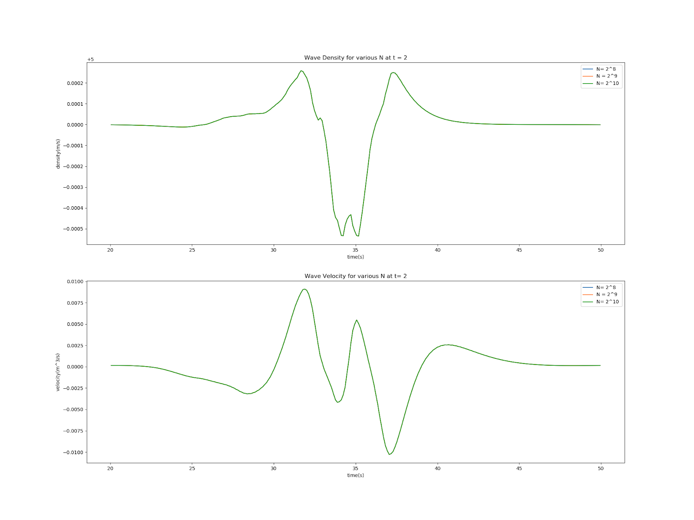
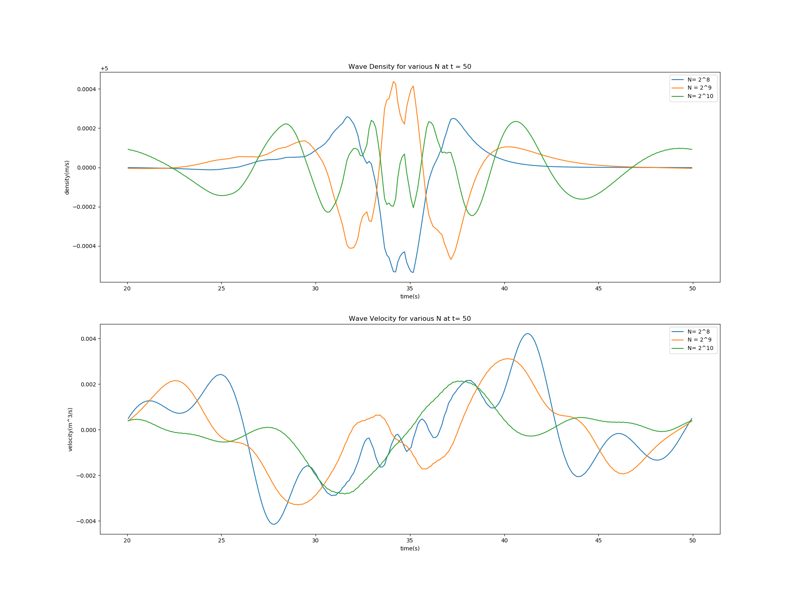
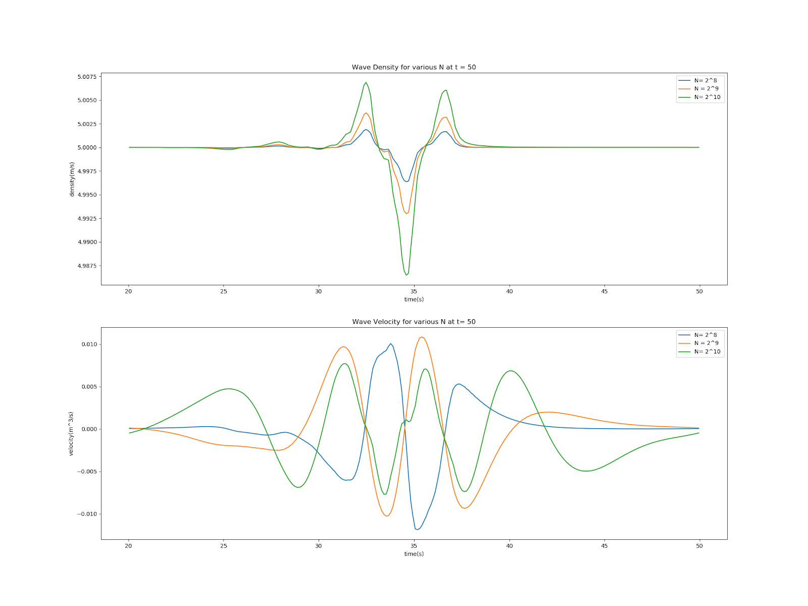

# Numerical Analysis for Simplified Tsunami Modelling 
> ATSC 409, Angelene Leow (23162167)

# Table of Contents:
- [Numerical Analysis for Simplified Tsunami Modelling](#numerical-analysis-for-simplified-tsunami-modelling)
- [Table of Contents:](#table-of-contents)
- [Introduction:](#introduction)
- [Construct of Numerical Model](#construct-of-numerical-model)
  - [Model 1](#model-1)
  - [Model 2](#model-2)
  - [Model 3](#model-3)
  - [Model 4](#model-4)
- [Results ( Figures and Analysis)](#results--figures-and-analysis)
  - [Model 1 & Model 2 (KdV Equation)](#model-1--model-2-kdv-equation)
  - [Model 3 (CH Equation)](#model-3-ch-equation)
  - [Model 4 (2 component CH equation)](#model-4-2-component-ch-equation)
- [Conclusion](#conclusion)
- [Appendix: Coding component](#appendix-coding-component)

# Introduction:

Tsunamis (seismic sea waves) are characterized by very large, tall and powerful breaking waves that are created by underwater disturbances. Tsunami waves can be generated by large amounts of energy produced through an earthquake, landslide, volcanic erruption or a meteorite event. Tsunami waves are known to travel hundreds of miles per hour and generate waves as tall as a hundred feet or more. Typical tsunami waves will travel in all directions from the source of generation. As waves approach the shoreline, the wave builds up in height due to an increase in the height of the ocean floor and cause mass destruction in its way due to the high amount of energy contained. 

There have been multiple destructive tsunamis in recent decades, namely the Tohoku earthquake generated tsunami in Japan (2011) that caused a nuclear meltdown, as well as the Great Indian Ocean quake in 2004 where over 200,000 lives were lost. These two events are great examples of how a fairly unpredicatable tsunami with regards to volume, location and release mechanism can cause severe damange and lost of lives. Hence I chose to focus my research on  modelling tectonic generated earthquakes. 

# Construct of Numerical Model 
 *Wave characteristics*: Since the speed of seismic waves (4km/s) is much faster than the propagation of long water waves (0.1-0.2 km/s), the seafloor deformation due to a tectonic earthquake occurs instantaneously. Hence **shallow water theory** is  applied for the modelling of tsunami waves. The tsunami wavelength, $\lambda$, is much larger than the water depth, $d$. The effect of wave dispersion can be neglected since the phase velocity, $\phi=f(d)$ is a function of only water depth. 

In several shallow application theory, we will be utilizing solutions from the Korteweg-de Vreis (KdV) equation,Camassa-Holm (CH) as well as a two-component Camassa-Holm (2CH) equation. To simplify the model, we will be modelling the waves in 1D with respect to time. To approximate these solutions, we will be using a variety of methods for discretization of space and time, including finite difference methods and Runge-Kutta. We will then test these models with known actual solutions, or test for a numerical convergence if there is no known solutions. Our goal is to find a model that preserves momentum and energy over time. In other words, the shape of the waves should remain the same. 

## Model 1

- wave equation: Korteweg-de Vreis (KdV) 
$$
\dfrac{du}{dt} + 6u\dfrac{du}{dx}  + \dfrac{d^{3}u}{dx} = 0
$$

or 

$$
u_t +6uu_x +u_{xxx}=0 $$

where $u= u(x,.t)$ = velocity 

Since $6u\dfrac{du}{dx}=6(\dfrac{1}{2}\dfrac{du^2}{dx})=3\dfrac{du^2}{dx}$

Thus the equation can be rewritten as:

$$
\dfrac{du}{dt}+3\dfrac{du^2}{dx}+\dfrac{d^3u}{dx^3}=0
$$

Next, we will use our finite difference method to numerically approximate the spatial solution.

- Using **central difference formula** for **spatial** discretization:

$$
3\dfrac{du^2}{dx} = 3\big[ \dfrac{(u^2_{i+1})-(u^2_{i-1})}{2x}\big]
$$

$$
\dfrac{d^{3}u}{dx} = \big[ \dfrac{(u_{i+2})-(2u_{i+1})+(2u_{i-1})-(u_{i-2})}{2x^3}\big]
$$

- Using **Forward Euler Method** for time discretization

$$
t^{N+1} = t^N + \Delta t
$$

$$
u_t = \dfrac{u_i^{N+1}-u_i^N}{\Delta t}
$$

Hence

$$
\dfrac{u_i^{N+1}-u_i^N}{\Delta t} + 3\big[ \dfrac{(u^2_{i+1})-(u^2_{i-1})}{2x}\big] + \big[ \dfrac{(u_{i+2})-(2u_{i+1})+(2u_{i-1})-(u_{i-2})}{2x^3}\big] = 0
$$

Let $F(u^N)=3\big[ \dfrac{(u^2_{i+1})-(u^2_{i-1})}{2x}\big] + \big[ \dfrac{(u_{i+2})-(2u_{i+1})+(2u_{i-1})-(u_{i-2})}{2x^3}\big]$

Hence, 

$$
\dfrac{u_i^{N+1}-u_i^N}{\Delta t} + F(u^N) = 0
$$

- Final simplified equation: 
>$$
u_i^{N+1}= u_i^N-\Delta  t\cdot F(u^N)
$$

We can then test this model against our known solution: 

- Actual solution: 
>$$
u(x,0 ) = \dfrac{1}{2}\sec^2{\dfrac{(x-t)}{2}} 
$$


- space interval : [-10,10]m , $\Delta x = 1m$

- time interval : [0,2]s, $\Delta t = 0.05s$ 

## Model 2 
We shall make a slight modification to model 1 by replacing the time discretization method with a third order Runge-Kutta method. 

- Wave equation: KdV  

- Using **central difference formula** for **spatial** discretization

- Using **third order Runge-Kutta Method** for time discretization:
$$
u^{N+1}= \dfrac{1}{3}u^N+\dfrac{2}{3}u^{(2)}+\dfrac{2}{3}\Delta t \cdot F(u^{(2)})
$$

$$
u^{(2)}= \dfrac{3}{4}u^N+\dfrac{1}{4}u^{(1)}+\dfrac{1}{4}\Delta t \cdot F(u^{(1)})
$$

$$
u^{(1)}= u^N+\Delta t \cdot F(u^{(N)})
$$

- Actual solution and initial condition is similar to Model 1
  
## Model 3
- Wave equation: Camassa-Holm (CH)
  $$
    m_t + um_x +2mu_x  = 0
  $$

 
  $$ m = u-u_{xx} $$

  where: $u(x,t)$ = velocity, 
$m(x,t)$ = momentum 

 Since $(um)_x=um_x+mu_x$, 
 $$
m_t +(um)_x +mu_x = 0 
$$


$$

$$
- Using **central difference formula** for **spatial** discretization
$$
(um)_x = \big[ \dfrac{(u_{i+1})-(u_{i-1}  \cdot m_{i-1})}{2x}\big]
$$

$$
mu_x = m_i\big[ \dfrac{(u_{i+1})-(u_{i-1})}{2x}\big]
$$

Rewritten equation:

>$$
m_t + \big[ \dfrac{(u_{i+1})-(u_{i-1}  \cdot m_{i-1})}{2x}\big] + m_i\big[ \dfrac{(u_{i+1})-(u_{i-1})}{2x}\big] = 0
$$

- Using **third order Runge-Kutta Method** for time discretization:
$$
u^{N+1}= \dfrac{1}{3}u^N+\dfrac{2}{3}u^{(2)}+\dfrac{2}{3}\Delta t \cdot F(u^{(2)})
$$

$$
u^{(2)}= \dfrac{3}{4}u^N+\dfrac{1}{4}u^{(1)}+\dfrac{1}{4}\Delta t \cdot F(u^{(1)})
$$

$$
u^{(1)}= u^N+\Delta t \cdot F(u^{(N)})
$$

- Discritize $m= u-u_{xx}$
$$
m_i = u_i - \big[ \dfrac{u_{i_2}-2u_i+u_{i-2}}{4x^3}\big]
$$

- solve linear algebra 

$$
\bar{m}=A\bar{u}
$$

$$
\begin{bmatrix}
m_1\\
m_2\\
. \\
. \\
m_n
\end{bmatrix} = A * \begin{bmatrix}
u_1\\
u_2\\
. \\
. \\
u_n
\end{bmatrix}
$$

$$
A=\begin{bmatrix}
1+\dfrac{1}{2x^2} & 0 & -\dfrac{1}{4x^2} & 0 & .. & 0 & -\dfrac{1}{4x^2} & 0 \\
0 & 1+\dfrac{1}{2x^2} & 0 & -\dfrac{1}{4x^2} & 0 & \ddot{} & 0 & -\dfrac{1}{4x^2}  \\ 
\ddots & \ddots & \ddots & \ddots & \ddots & \ddots & \ddots \\
0 & \ddot{} & 0 & -\dfrac{1}{4x^2} & 0  &  1+\dfrac{1}{2x^2} & 0 &-\dfrac{1}{4x^2}\\
-\dfrac{1}{4x^2} & 0 & \ddot{} & 0 & -\dfrac{1}{4x^2} & 0  &  1+\dfrac{1}{2x^2} & 0 \\
 0 & -\dfrac{1}{4x^2} & 0 & \ddot{} & 0 & -\dfrac{1}{4x^2} & 0  &  1+\dfrac{1}{2x^2} \\
\end{bmatrix}
$$

We can then test this model against our known solution: 

- Actual piecewise function solution: 
 $$ u(x,t)=   \left\{
\begin{array}{ll}
      \dfrac{cos(x-t+5)}{cos(15)} & |x+5|\leq 15 \\
      \dfrac{cos\big(30(x-t+5)\big)}{cos(15)}  & |x+5|> 15 \\
\end{array} 
\right.  $$


## Model 4 
- Wave equation: 2 component Camassa-Holm (CH)
  $$
    m_t + um_x +2mu_x  = - g\rho\rho_x
  $$

 
  $$ m = u-u_{xx} $$

  Continuity equation: 
  $$ \rho_t + (\rho u )_x = 0 $$

  where: 
  
  $u(x,t)$ = velocity, 
  
  $m(x,t)$ = momentum ,

  $\rho(x,t)$ = density, 

  g= gravity constant

From a quick glance, the equation looks similar to model 3, except it now has a "forcing term" given by '$-g\rho\rho_x$'.

Since $(um)_x=um_x+mu_x$,
$$
m_t + (um)_x+mu_x = -g\rho\rho_x
$$

and $-g\rho\rho_x=-g(\dfrac{1}{2}\rho^2)_x=\dfrac{-g}{2}(\rho^2)_x$

 Simplified equation: 
 $$
m_t +(um)_x +mu_x = -\dfrac{g}{x}\rho^2x
$$
- Using **central difference formula** for **spatial** discretization
$$
(um)_x = \big[ \dfrac{(u_{i+1})-(u_{i-1}  \cdot m_{i-1})}{2x}\big]
$$

$$
mu_x = m_i\big[ \dfrac{(u_{i+1})-(u_{i-1})}{2x}\big]
$$

$$
-\dfrac{g}{x}\rho^2x = -\dfrac{g}{2}\big[ \dfrac{(\rho_{i+1}^2)-( \rho^2_{i-1})}{2x}\big]
$$

$$
(\rho u ) _x= \big[ \dfrac{(\rho_{i-1}* u_{i-1})-( \rho_{i+1}*u_{i+1})}{2x}\big]
$$
Rewritten equation:

>$$
m_t + \big[ \dfrac{(u_{i+1})-(u_{i-1}  \cdot m_{i-1})}{2x}\big] + m_i\big[ \dfrac{(u_{i+1})-(u_{i-1})}{2x}\big] = 0
$$

- Using **third order Runge-Kutta Method** for time discretization:
$$
u^{N+1}= \dfrac{1}{3}u^N+\dfrac{2}{3}u^{(2)}+\dfrac{2}{3}\Delta t \cdot F(u^{(2)})
$$

$$
u^{(2)}= \dfrac{3}{4}u^N+\dfrac{1}{4}u^{(1)}+\dfrac{1}{4}\Delta t \cdot F(u^{(1)})
$$

$$
u^{(1)}= u^N+\Delta t \cdot F(u^{(N)})
$$

- Discritize $m= u-u_{xx}$
$$
m_i = u_i - \big[ \dfrac{u_{i_2}-2u_i+u_{i-2}}{4x^3}\big]
$$

- solve linear algebra (similar to model 3)
- initial condition (Dam Break Problem)
$$
\rho(x,0)=1+\tan(x+4)-\tan (x-4)  \\
U_0 = 0 
$$

- NO actual solution 
- space interval: [-12 $\pi$,12 $\pi$] 
- N = number of steps taken
- time interval: [0,2]s , $\Delta t=0.01 s$

Since the 2 compenent Camassa Holm equation does not have an actual solution, we will test our solution using numerical convergence for a test dataset obtained from the [Propagation Database](https://nctr.pmel.noaa.gov/propagation-database.html) by NOAA Center for Tsunami Research at the Pacific Marine Environmental Laboratory. 
The dataset includes initial conditions for density and velocity. I split it into 3 datasets with  varying number of data points. 
The first set contains 256 ($2^{8}$) data points for both density and velocity,
the second has 512 ($2^{9}$) data points for both density and velocity, 
the third has 1024 ($2^{10}$) data points for both density and velocity.


# Results ( Figures and Analysis)
## Model 1 & Model 2 (KdV Equation)
 
This plot was done with a step size of $\Delta t = 0.05s$ and space interval of $\Delta x = 1m$.
Our model follows some aspect of wave behavior but did not achieve a satisfactory match with the actual solution as time increases. 

 
 This plot was created after getting feedback from Susan about decreasing the time step to improve accuracy. Here the model is run with a step size of $\Delta t = 0.01s$ and a space interval of $\Delta x = 0.1m$

 The model fits much better with the actual solution!

I omitted out Forward Euler from the second plot as the 
Runge–Kutta method have been proven to be superior to the leapfrog methods in many reference papers. 

## Model 3 (CH Equation)
 

 We can see that the solution generates a pointy edge called a peakon soliton. This shape is generated because of a discontinuous first derivative in the piecewise solution. Compared to the KdV equation, 
the CH equation is much better at preserving the shape of the wave. However, at $t=2s$ and $t=200s$ we could still observe a numerical diffusion taking place at the bottom left of the wave (notice the zig-zag). Numerical dispersion occurs when a higher order discretisation scheme is used to improve accuracy of the result. In this case it may be due to the truncation error of the discretisation.

## Model 4 (2 component CH equation)
   
   
  Plotting varied times for ($N = 2^{10}$) did not tell give us any meaningful result. Hence we tested our solution using numerical convergence. 
   
   That's great! For all our data pointsat $t=2s$, we were able to get similar wave shapes! Energy and momentum is conserved. Let's move on to see if this property is preserved for a longer $t$.
 
Oh no! The wave density plot (above) looks chaotic at $t= 35s$ whereas the velocity plot does seem to have a general oscillating trend, with the bigger N showing a bigger wavelength. 

- Changing parameter: length scale-bifurication parameter ($\alpha$) to 
$$m=u-u_{xx} $$

So it becomes 

$$m=u-\alpha ^2u_{xx} $$

For $\alpha  = 0.1$
  
The plot looks much better with the wave shapes oscillating almost similarly for the wave density while the wave velocity still shows some disagreement, but the phase velocity looks more identical than before.  

# Conclusion 
Based on two of our shallow wave equations, we were able to find good models to visualize accuracy of waves propagating at early times. This is highly crucial for a good prediction model as one of the reasons for the unavailability of tsunami prediction models is due to unknown wave characteristics during early generation of waves. 
If we are able to model behavior of these energy high waves efficiently, the better prepared we are to mitigate a catastrophic natural disaster. There is an issue of scalability which may be concerning given the time sensitivity nature of this model. It has been found that the speed of the 2 component CN model is directly proportional to the amount of data points, $N$. Thus this model would require a significant amount of time to run before results are delivered. 

# Appendix: Coding component 

Most of the functions have been commented nicely to provide clarification. 
    
 In `KDV.py`, we have the running algorithms for the KdV equation. Similar running codes such as `CH.py` and `CH2.py` can all be found on my GitHub repository. 
 

 1.	A function definition called `findx(h)` is created to find the spatial interval (need to create a list to store all the x-values that will be tested, h(step size) as a parameter so that we know which numerical values to put in the list). 

 ```
 def findx(h):
    x = []
    index = 0
    stepsize = int(1/h)
    for i in range(-10,10):
        i = float(i)
        x.append(i)
        for j in range(1,stepsize):
            index = index + h
            k = round((i + index), 2)
            x.append(k)
        index = 0
    x.append(10.0)
    return x
 ```

1. Function to find the time interval (need to create a list to store all the t-values that will be tested, h (step size) as a parameter so that we know which numerical values to put in the list). 

```
def findt(h):
    t = []
    index = 0
    stepsize = int(1/h)
    for i in range(0,2):
        i = float(i)
        t.append(i)
        for j in range(1,stepsize):
            index = index + h
            k = round((i + index), 2)
            t.append(k)
        index = 0
    t.append(2.0)
    return t
```
3. Function to find the initial position for velocity (need to use list `x` and equation to find initial `u` position at each location in space)


```
def wavePosition(x):
    u = []
    for i in range(len(x)):
        temp = .5*((1/(np.cosh(.5*x[i])))**2)
        u.append(temp)
    return u
```

4. Function to use discretized spatial equation (need to use list “u” and equation to find the spatially discretized `u`)

```
def disUX(u,x):
    # the next position
    u_prime = []

    #step size
    size = len(x)-1
    #sections
    h = 20/(len(x))

    # for each element in u, we want to calculate the derivative with respect to x
    for i in range(len(x)):
        if i == 0:
            #first calculate the discretized element 6UU(sub-x)
            firstElement = -3*((((u[i+1])**2)-((u[(size-1)])**2))/(2*h))
            #second calculate the discretized element U(sub-xxx)
            secondElement = -((u[(i+2)])-(2*(u[(i+1)]))+(2*(u[(size-1)]))-(u[(size-2)]))/((2*h)**3)
            u_prime.append(firstElement + secondElement)
        elif i == 1:
            #first calculate the discretized element 6UU(sub-x)
            firstElement = -3*((((u[i+1])**2)-((u[(i-1)])**2))/(2*h))

            #second calculate the discretized element U(sub-xxx)
            secondElement = -((u[(i+2)])-(2*(u[(i+1)]))+(2*(u[(i-1)]))-(u[(size)]))/((2*h)**3)

            u_prime.append(firstElement+secondElement)
        elif i == size:
            #first calculate the discretized element 6UU(sub-x)
            firstElement = -3*((((u[1])**2)-((u[(size-1)])**2))/(2*h))

            #second calculate the discretized element U(sub-xxx)
            secondElement = -((u[(2)])-(2*(u[(1)]))+(2*(u[(i-1)]))-(u[(i-2)]))/((2*h)**3)

            u_prime.append(firstElement+secondElement)
        elif i == (size-1):
            #first calculate the discretized element 6UU(sub-x)
            firstElement = -3*((((u[i+1])**2)-((u[(i-1)])**2))/(2*h))

            #second calculate the discretized element U(sub-xxx)
            secondElement = -((u[(1)])-(2*(u[(i+1)]))+(2*(u[(i-1)]))-(u[(i-2)]))/((2*h)**3)

            u_prime.append(firstElement+secondElement)
        else:
            #first calculate the discretized element 6UU(sub-x)
            firstElement = -3*((((u[(i+1)])**2)-((u[(i-1)])**2))/(2*h))

            #second calculate the discretized element U(sub-xxx)
            secondElement = -((u[(i+2)])-(2*(u[(i+1)]))+(2*(u[(i-1)]))-(u[(i-2)]))/((2*h)**3)

            u_prime.append(firstElement+secondElement)
    print u_prime
    return u_prime
```

5. Function to use discretized equation for time (need to use spatially discretized list “u” and equation to find the discretized “u” in time, which is “u” for the next time interval)
  ```
   def disUT(u,u_ux,x):
    #change in time varible hard coded as .01
    deltaT = .01

    #list to hold all solutions that are a result of the discretized Ut function
    u_prime = u_ux

    a = []
    b = []
    c = []
    d = []
    e = []

    for i in range(len(u)):
        k = u[i] + (deltaT*u_prime[i])
        a.append(k)
    
    b = disUX(a,x)

    for i in range(len(a)):
        k = (.75*u[i]) + (.25*a[i]) + (.25*deltaT*b[i])
        c.append(k)

    d = disUX(c,x)

    for i in range(len(c)):
        k = ((1/3)*u[i]) + ((2/3)*c[i]) + ((2/3)*deltaT*d[i])
        e.append(k)

    return e

```
6. Function to call the discretized spatial function and discretized equation for time function. 
```
def kdv(u,x):
    u_ux = disUX(u,x)
    u_ut = disUT(u,u_ux,x)
    return u_ut
```
7. Function to find the actual position for velocity (need to use list `x` and equation to find `u` position at each location in space for all values in our time interval). In the Main function we will pass the specific value for time in our time interval that we are at. 

```
def actualWavePosition(x,t):
    u = []
    for i in range(len(x)):
        temp = .5*((1/(np.cosh(.5*(x[i]-t))))**2)
        u.append(temp)
    return u
```


